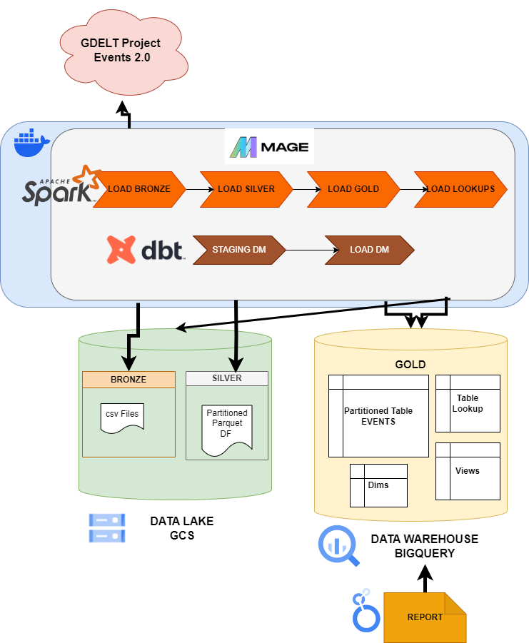
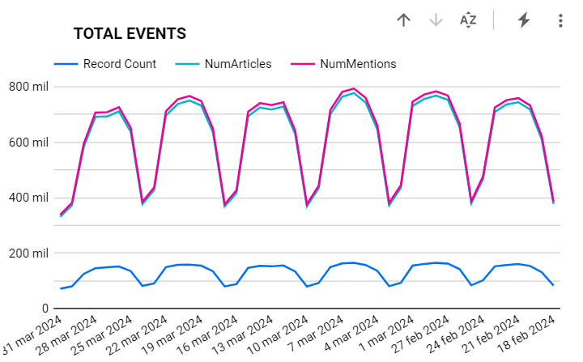

# Data Engineering Zoomcamp Cohort 2024
# GDELT Project Events Data Workflow and Visualization

## GDELT Project

Put simply, the GDELT Project is a realtime open data global graph over human society as seen through the eyes of the world's news media, reaching deeply into local events, reaction, discourse, and emotions of the most remote corners of the world in near-realtime and making all of this available as an open data firehose to enable research over human society.

*"The GDELT Project is an initiative to construct a catalog of human societal-scale behavior and beliefs across all countries of the world, connecting every person, organization, location, count, theme, news source, and event across the planet into a single massive network that captures what's happening around the world, what its context is and who's involved, and how the world is feeling about it, every single day."*

[GDELT Project Website](https://www.gdeltproject.org/)

## GDELT Event 2.0 Database
The GDELT Event Database records over 300 categories of physical activities around the world, from riots and protests to peace appeals and diplomatic exchanges, georeferenced to the city or mountaintop, across the entire planet dating back to January 1, 1979 and updated every 15 minutes.

Nearly 60 attributes are captured for each event, including the approximate location of the action and those involved. This translates the textual descriptions of world events captured in the news media into codified entries in a grand "global spreadsheet.". GDELT 2.0 adds a wealth of new features to the event database and includes events reported in articles published in the 65 live translated languages. The core event table is largely the same with a few additional columns, but there is a new "mentions" table and several other changes and the data updates every 15 minutes. 

Some features:
- 15 Minute Updates
- Realtime Translation of 65 Languages
- Realtime Measurement of 2,300 Emotions and Themes
- High Resolution View of the Non-Western World
- Relevant Imagery, Videos, and Social Embeds.
- Quotes, Names, and Amounts
- Tracking Event Discussion Progression.


[More info](https://blog.gdeltproject.org/gdelt-2-0-our-global-world-in-realtime/)

## Our Problem
In this project, we build a data workflow to ingest, transform and store events from the GDELT Project Event 2.0 database for a established period of time, by default, 45 days. We apply the **Medallion Arquitecture**. A medallion architecture is a data design pattern used to logically organize data in a lakehouse, with the goal of incrementally and progressively improving the structure and quality of data as it flows through each layer of the architecture (from Bronze ⇒ Silver ⇒ Gold layer tables). 

Once our data is in a data warehouse in the **Gold stage**, we use [dbt software](https://www.getdbt.com/product/what-is-dbt) to create a set of views, for our staging area, and a set of dimension tables and facts tables, for our datamart. Then we can create reports to show information to our users. We give you a report as an example of data visualization. 

### Workflow and process description


1. Ingestion to **Bronze** stage:  
	- Download and read the Master CSV data file list
	- Take the filenames of the csv data files generated in the last n days, 45 days in our example, **about 4,300 csv zipped files**
	- Download each csv zipped file from the GDELT Project page, unzip it and concatenate to a csv file, each csv file contains 30 csv files from GDELT Project.
	- Save the source files to our bronze stage in a bucket on Google Cloud Storage
2. Transformation to **Silver** stage:
	- Read the csv files from the bronze container to a Spark Dataframe
	- Select and transform the fields we are interested in.
	- Save the transformed Dataframe to parquet format in the Silver container and **partitioned by week**.
3. Transfer to a BigQuery Parttioned Table in the **Gold** Data Warehouse
	- Read the parquet data to a Spark Dataframe
	- Store the data into a BigQuery Table **partitioned by week**
	- The `events` table contains **about 5,7 million** rows for 45 days.
4. Ingest and store **Lookup data**:
	- Read the lookup tables from the GDELT Project Event database in csv format
	- Convert it to a Pandas Dataframe and categorize each type of table.
	- Save the lookup data in csv format in the **bronze** and **silver** containers in Cloud Storage and to a BigQuery table in the **Gold** Data Warehouse.
5. Prepare **staging area**:
	- Create BigQuery views to prepare our data for reporting tasks.
	- Only create a simple example, containing 2 dimensions and 2 table of aggregated facts.
6. Load the **"datamart" area**:
	- Create 4 BigQuery tables based on the views of the staging area.
	- We join data from the Event Code and Actor Type dimensions to the Event Fact table, creating a teo tables of aggregated facts by event code and actor type.

We build and run our workflow in ***Mage** and use **Apache Spark** to manage and transform all data efficiently from source to Bronze to Gold stages.Each numbered step corresponds to a **Pipeline** in Mage, and each pipeline triggers the next one in the flow.  The steps 5 and 6 are **dbt** models and process to get our dimensional model (only for our report needs).

A detailed explanation on the pipelines, blocks and code is on the folder `mage-code`, [README](mage-code/README.md).

## To Run the Demo
You can clone this repo and run the **Docker** container in your preferred environment to launch Mage with Spark and execute the Workflow. For example, you can run the container in a VM in GCP, a GitHub Codespace, in Google Cloud Run or even in your local machine.

Finally, you can visualize the data in a [dashboard]((https://lookerstudio.google.com/reporting/f1018a56-01ea-422b-8c40-ea9b1a87ee01)) on **Looker Studio**. 

## Prerequisites to run the project demo
1. Docker:
	You need to install docker for your OS. [Link to installation](https://docs.docker.com/engine/install/) 
2. Git
	You can install Git from this [link](https://git-scm.com/book/en/v2/Getting-Started-Installing-Git)
3. Terraform
	Installation: https://developer.hashicorp.com/terraform/install

**Note:** You can use a GitHub Codespace to run this demo, it's installed both Docker and Git. You can watch [this video](https://youtu.be/XOSUt8Ih3zA&list=PL3MmuxUbc_hJed7dXYoJw8DoCuVHhGEQb&index=15) for instructions on how to prepare a Codespace.

## Instruction to prepare your GCP for this demo
1. Create a GCP Project 
	Our example Project_id = 'gdelt-project-data'
2. Create a service account in the project, grant it the permissions:
	- Storage Admin
	- Bigquery Admin
	- Service Usage Admin
	- Service Management Administrator
    You can include more permissions if you want to expand this project for a future use.

	Our example Project_id = 'gdelt-project-account'

3. Create an access key JSON file, you need to download its private key file. 
	- This key file will be used to authenticate requests to GCP services.
	- Select the service account you just created to view its details, Click on the "Keys" tab and then click the "Add Key" button.
	- Select the "JSON" key type and click "Create" to download the private key file. 
	  **Rename your json file to `gdelt-project-credentials.json` and copy it to the mage directory `mage-gdelt` and the terraform folder `terraform`**

## To launch the project container
1. Clone the repo to your local folder or to a VM or Github Codespace
```bash
git clone https://github.com/edumunozsala/GDELT-Events-Data-Eng-Project.git
```

2. Copy the json file with the GCP service account credentials to the folders `terraform` and `mage-gdelt` with the filename `gdelt-project-credentials.json`
3. Create the GCP objects with Terraform

**You can modify the file `variables.tf`, if you want to change the names of the GCP object to create for this demo. You will also need to modify the `.env` file**

4.  `cd` into the terraform directory.
```bash
cd terraform
```

5. Initialize terraform folder

```bash
terraform init
```
6. To show changes to apply:

```bash
terraform plan
```
7. To create or update infrastructure:

```bash
terraform apply
```
**Our terraform script enable the BigQuery API**

8. `cd` into mage directory `mage-gdelt`
```bash
cd mage-gdelt
```

9. Rename the file `dev.env` to `.env` and review the parameters.

	You can change the values of the GCP Objects: the buckets name and dataset you create with terraform
	but **you must not change PROJECT_NAME, SPARK_MASTER_HOST, GOOGLE_APPLICATION_CREDENTIALS, ENV variables**
	
	*Days to collect*: you can change this value if you want to collect more or less data. Be carefull with the value you include because if can increase the execution time.

	**Important**: The GCP objects in the .dev file should be the same defined in the terraform scripts.

10. Build the container
```bash	
docker compose build
```
11. Run the contaier
```bash
docker compose up
```

12. Open Mage UI in your web browser.
	If you are running it locally go to http://localhost:6789, but this link may differ depending on where and how you run the docker container.
13. To run the whole workflow you just need to open the `load_bronze_gcs` pipeline and click the run once button.


Click on run@nce:


Go to logs to watch how the process advance, when a pipeline finish the next one is automatically launch. Open every pipeline to see the logs.

**It takes about 15-20 minutes to download and move to Cloud Storage all the csv files, 4,300, and about 10 minutos to process them and create the dataframes and tables. Finally, the tables and views in our dimensional data warehouse for reporting take about 3-4 minutes.**

14. Once the workflow has finished you can go to the dashboard on [Looker Studio](https://lookerstudio.google.com/reporting/f1018a56-01ea-422b-8c40-ea9b1a87ee01)

**IMPORTANT**: When you are done you can destroy the GCP bjects :

```bash
cd terraform
terraform destroy
```


## Dashboard and Visualizations in Looker Studio

We have published a report in [Looker Studio](https://lookerstudio.google.com/reporting/f1018a56-01ea-422b-8c40-ea9b1a87ee01) to show you some insights on the GDELT Project Events Database.

It is just an example, using our Events table partitioned by Week, so you can select the week on the report. the source of some figures are our aggregated tables of events, one by the type of event and the other by the actor 1 and 2 types.

**FIGURES**



